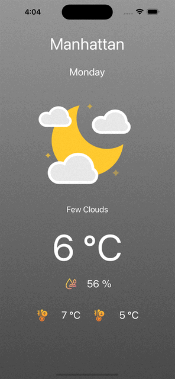

# WeatherNow
App build using UIKit and CoreLocation. App use your current location to retrieve weather data from OpenWeather API, and then display weather information on screen.

Packages userd:
- [Alamofire](https://github.com/Alamofire/Alamofire)
- [Lottie](https://github.com/airbnb/lottie-ios)
- [SkeletonView](https://github.com/Juanpe/SkeletonView)
 
Icons used in this app are from Flaticon:
- [Humidity Icon](https://www.flaticon.com/free-icon/humidity_5664996) 
- [Max Temp Icon](https://www.flaticon.com/free-icon/temperature-control_7649409)
- [Min Temp Icon](https://www.flaticon.com/free-icon/temperature-control_7649404)

GIF Used:

- [Weather GIF](https://lottiefiles.com/vdr0uy2wwsoljqtc)

Sample screen
 

